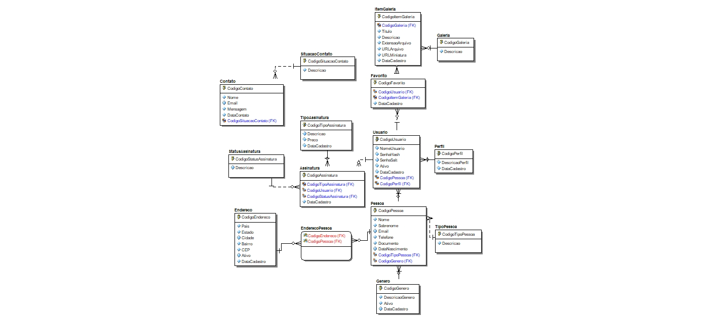

# Projeto WAVE - Agência de Marketing

Este repositório contém o código-fonte do site da WAVE, uma agência de marketing digital. O projeto está sendo desenvolvido como parte do Trabalho de Conclusão de Curso (TCC) da ETEC Comendador João Rays.

## Arquitetura do Projeto

Este projeto segue os princípios da **Arquitetura Limpa (Clean Architecture)**, com uma separação clara de responsabilidades em camadas.

## Requisitos
### Sistema de Login e Registro com Autenticação JWT

- O sistema permite que os usuários acessem diversas funcionalidades do site, incluindo a página **Home**, a página de **Assinaturas**, a galeria gratuita de **mockups e PSD**, e o formulário de **Contato**, sem a necessidade de estar logado ou ter uma conta cadastrada. 
- Os usuários podem acessar a página de assinaturas sem estar logados, mas ao clicar para assinar, serão redirecionados para a autenticação antes de prosseguir. Usuários cadastrados terão o perfil **"usuário"** e iniciarão com um **plano gratuito**, podendo alterar para uma assinatura paga a qualquer momento.
- Usuários com o perfil **"admin"** terão acesso a telas de **gerenciamento de usuários** e suas assinaturas, podendo alterar, excluir ou incluir. Esses usuários também poderão gerenciar os **mockups e PSDs** das galerias.
- Os usuários podem realizar login utilizando **email** ou **NomeUsuario**, ambos únicos.

### Sistema de Planos por Assinatura

- O usuário pode ter apenas **um plano assinado** por vez.
- Se o usuário desejar alterar o plano, o sistema verificará se ele já possui um plano pago ativo.
- Se o usuário tiver um plano assinado e assinar outro, o sistema cancelará o plano anterior e atualizará para o novo.
- O usuário pode **cancelar a assinatura** a qualquer momento.
- Cada assinatura terá uma página dedicada, explicando seus benefícios.
- O sistema fornecerá um **histórico de assinaturas anteriores**, permitindo que o usuário veja a validade de cada plano.

### Galeria

#### Galeria Gratuita para Usuários

- Usuários com o perfil **"suporte"** terão uma interface para adicionar, excluir e alterar itens da galeria gratuita.
- Os itens da galeria gratuita poderão ser baixados e visualizados **sem autenticação** ou conta criada.
- As galerias poderão ser **filtradas** por tipo de arquivo, tipo de assinatura (gratuitos ou exclusivos) ou por pesquisa.
- Usuários autenticados poderão **favoritar** itens da galeria, que serão armazenados em uma seção de favoritos no perfil.

#### Galeria Exclusiva para Assinantes

- Apenas assinantes com um plano específico terão acesso aos **itens exclusivos**.
- Os assinantes poderão solicitar **designs personalizados** a designers através de um grupo exclusivo.
- Itens exclusivos terão uma **marcação na galeria**, indicando que é necessário ser assinante para download.
- Usuários não-assinantes que tentarem baixar itens exclusivos serão redirecionados para a **tela de assinaturas**.

### Perfis e Permissões

- **Admin**: Permissão máxima, com acesso ao gerenciamento de todas as funcionalidades do site.
- **Suporte**: Permissão limitada, gerenciando apenas recursos relacionados às galerias e envios.
- **Usuário**: Permissão limitada, utilizando o site e recebendo envios.

### Formulário de Contato com a Agência

- Qualquer pessoa pode entrar em contato com a **WAVE** através do formulário de contato, **sem necessidade de autenticação**.
- As mensagens serão recebidas e respondidas por **email**.

### Telas Necessárias

- **Login e Cadastro**
- **Home**
- **Formulário de Contato** para serviços da agência
- **Galeria de Mockups e PSDs**

- **Preferências do Usuário**
- **Itens Favoritos**
- **Dados do Usuário** (alterar dados, trocar email e senha)
- **Assinatura**
  - **Gerenciar Assinatura**
  - **Histórico de Assinaturas**

#### Funcionalidades para Admin/Suporte

- **Gerenciamento da Galeria** (CRUD)
- **Gerenciamento de Assinaturas** (CRUD)
- **Gerenciamento de Usuários** (CRUD)

## Diagrama do Banco de Dados

## Ferramentas Utilizadas para Desenvolver o Projeto

### Design e Prototipação
- **Figma**: Utilizado para o design e prototipação de interfaces.
- **Photoshop**: Criação de templates e recursos gráficos.

### Banco de Dados
- **ER/Studio**: Utilizado para modelagem de dados e diagramas ER.
- **SQL Server**: Sistema de gerenciamento de banco de dados utilizado no projeto.
- **SSMS (SQL Server Management Studio)**: Ferramenta de gerenciamento e administração do banco de dados.

### Back-end - Web API
- **Dapper**: Micro ORM utilizado para facilitar as interações com o banco de dados.
- **Dapper Contrib**: Extensão do Dapper para simplificação de operações CRUD.
- **Entity Framework**: ORM utilizado para o mapeamento de objetos relacionais.
- **JWT (JSON Web Token)**: Autenticação baseada em token para controle de acesso.
- **C#**: Linguagem de programação utilizada no desenvolvimento da Web API.
- **ASP.NET**: Framework para construção da Web API.

### Front-end
- **Angular**: Framework front-end utilizado para construir a interface do usuário.
- **Typescript**: Linguagem de programação que expande o JavaScript com tipagem estática.
- **HTML**: Linguagem de marcação para estruturar as páginas web.
- **CSS**: Linguagem de estilos para customizar a aparência das páginas web.

### Teste de API
- **Swagger**: Ferramenta para documentar e testar a API de forma interativa.
- **Postman**: Utilizado para testar e depurar as chamadas da API.

### IDEs
- **Visual Studio Code**: Editor de código utilizado para o desenvolvimento front-end.
- **Visual Studio Community 2022**: IDE utilizada para o desenvolvimento da Web API